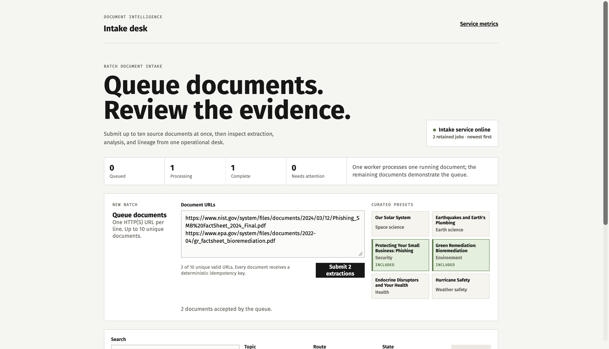
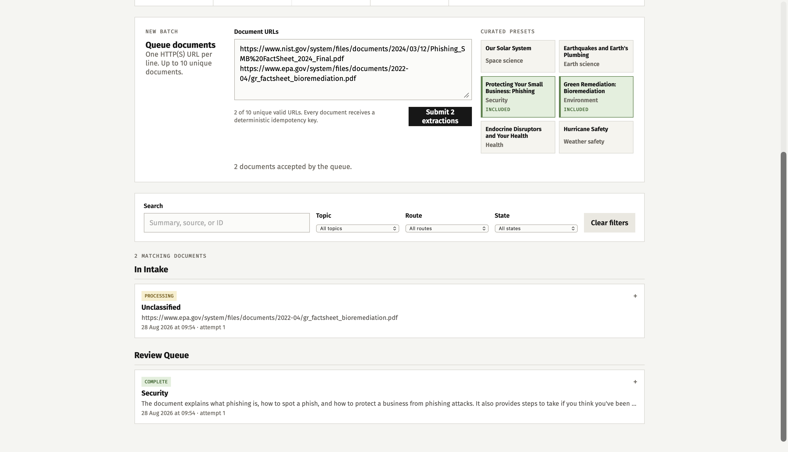
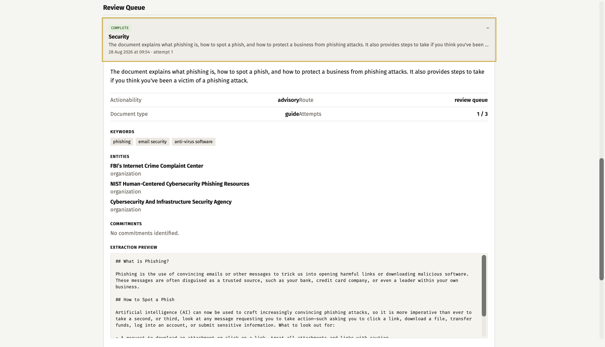
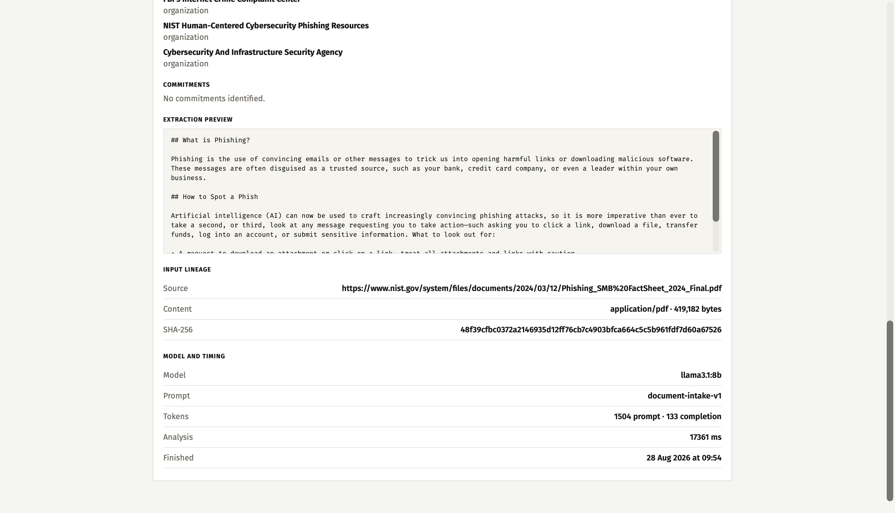
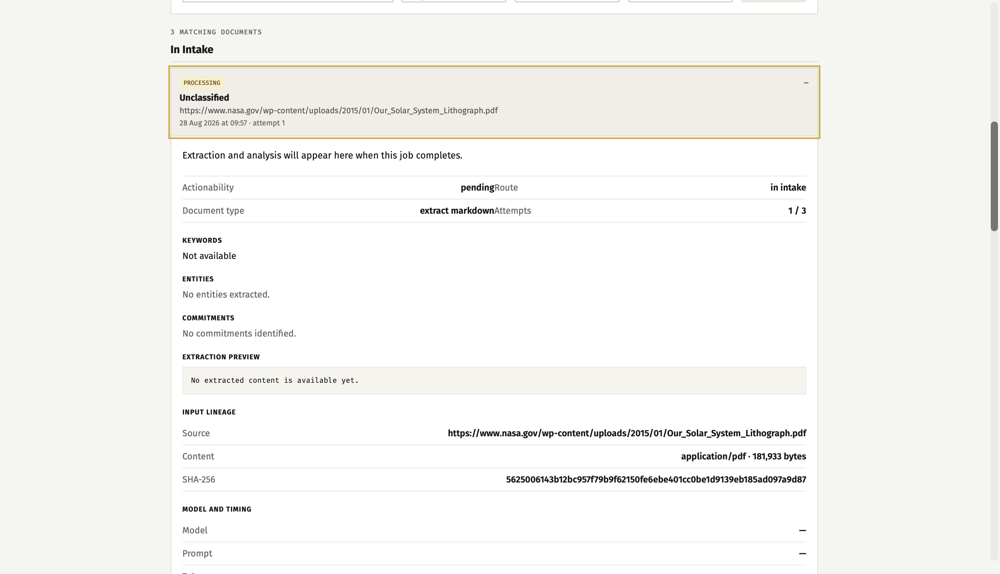
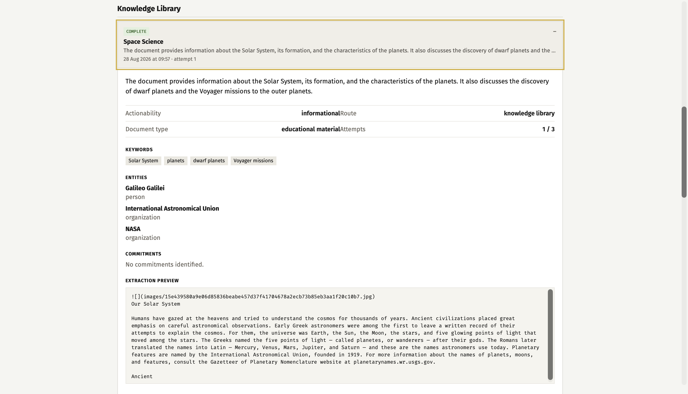
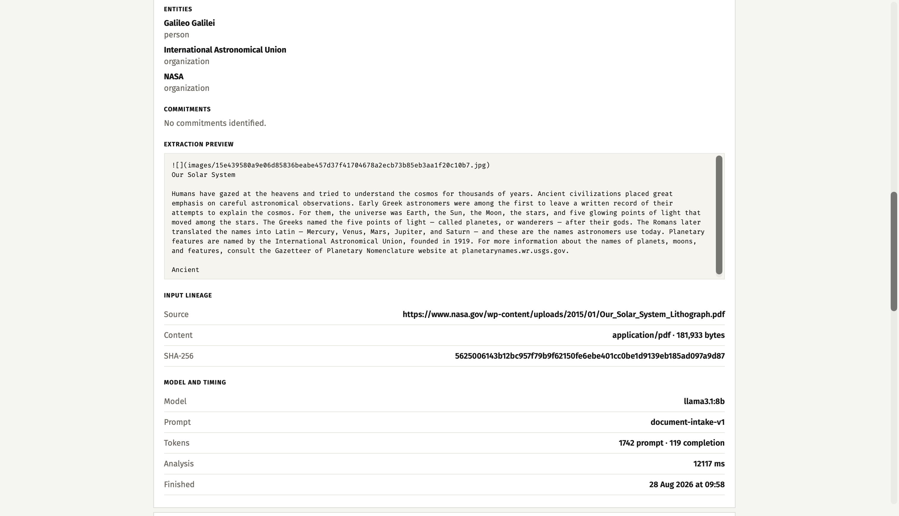
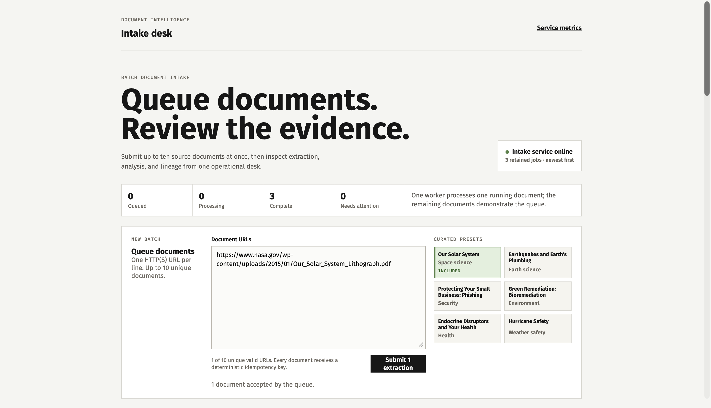

# Document Processing Service

This project is a local document intelligence intake service. It accepts a document URL, creates an asynchronous job, extracts document text with MinerU, and uses a local Ollama model to prepare a review card.

The review card contains a topic, document type, short summary, keywords, entities, actionability, routing decision, and explicit commitments. Each commitment must include evidence from the extracted text. The service is designed as a practical demonstration of document ingestion, local model orchestration, lineage, retries, and observable background work.

## Components

- **MinerU** extracts structured document content and Markdown from PDFs and office files.
- **Ollama** runs a local text-only LLM. This project uses `llama3.1:8b` by default for structured document analysis.
- **FastAPI** provides job, health, and metrics endpoints.
- **React and Vite** provide the Document Intelligence Intake Desk dashboard.

## Workflow

```text
Document URL
→ protected download
→ input SHA-256 and lineage
→ MinerU Markdown extraction
→ Ollama structured analysis
→ deterministic route
→ job result and dashboard
```

A document goes to `action_queue` when it has an explicit obligation. Security, weather-safety, and emergency advice go to `review_queue`. Other documents go to `knowledge_library`.

## One-command demo

After the first dependency setup, start the complete local demo from the project root:

```bash
./scripts/demo.sh restart
```

The script checks Ollama, starts MinerU, FastAPI, and Vite in the correct order, waits for each health endpoint, and opens `http://127.0.0.1:5173` on macOS. It reuses an existing healthy Ollama process. Logs and PID files stay under `.runtime/demo/`.

Useful commands:

```bash
./scripts/demo.sh status
./scripts/demo.sh logs
./scripts/demo.sh stop
./scripts/demo.sh restart
```

The dashboard accepts one URL per line, up to ten unique documents. Curated presets make a batch easy to prepare. One worker processes one document while the remaining jobs stay queued, so the asynchronous flow is visible in the state counters and job list.

For manual development, the API uses Python 3.13 and uv, while the dashboard uses Node.js and npm. The longer service commands are listed below for troubleshooting.

## Local model services on macOS

MinerU and Ollama run outside the application container. This is intentional. Docker Desktop on macOS cannot expose Apple MPS or MLX acceleration to a MinerU container.

Start Ollama normally, then confirm the required model is available:

```bash
ollama list
ollama run llama3.1:8b
```

Start the isolated MinerU API from the project root:

```bash
HOME="$PWD/.runtime/home" HF_HOME="$PWD/.runtime/huggingface" \
  .runtime/mineru-venv/bin/mineru-api --host 127.0.0.1 --port 8000
```

The isolated MinerU environment also needs `mineru[pipeline]` and `six`. MinerU 3.4.5 currently omits `six` from its pipeline dependency declaration even though the hybrid backend imports it.

## Submit a job

```bash
curl -i http://127.0.0.1:8080/jobs \
  -H 'Content-Type: application/json' \
  -H 'Idempotency-Key: report-001' \
  -d '{"document_url":"https://example.org/report.pdf","operation":"extract_markdown"}'
```

Use the job ID to check progress:

```bash
curl http://127.0.0.1:8080/jobs/JOB_ID
curl http://127.0.0.1:8080/jobs
curl http://127.0.0.1:8080/health/ready
curl http://127.0.0.1:8080/metrics
```

`GET /jobs` returns at most 100 in-memory jobs, newest first. It exists for the local dashboard and is not intended as a durable production archive.

## Demonstration corpus

`examples/corpus.json` lists 22 locally validated, public-source PDFs across eight topics. The PDFs are not committed. They are downloaded to `.runtime/corpus/pdfs` by the local acquisition script.

```bash
.runtime/mineru-venv/bin/python .runtime/download_corpus.py
PYTHONPATH=. .venv/bin/python .runtime/run_evals.py
```

The corpus contains space science, earth science, security, environment, health, weather safety, finance and currency, and emergency preparedness documents. The manifest records source URLs, publishers, expected labels, page counts, sizes, and SHA-256 hashes.

## Docker

```bash
docker compose up --build
```

The container exposes port 8080. On macOS it calls native services through `host.docker.internal`:

- MinerU: `http://host.docker.internal:8000`
- Ollama: `http://host.docker.internal:11434`

Override the following values when services run elsewhere:

| Variable | Default | Meaning |
| --- | --- | --- |
| `PAPERTRAIL_MINERU_BASE_URL` | `http://127.0.0.1:8000` | MinerU API address |
| `PAPERTRAIL_OLLAMA_BASE_URL` | `http://127.0.0.1:11434` | Ollama API address |
| `PAPERTRAIL_OLLAMA_MODEL` | `llama3.1:8b` | Local analysis model |
| `PAPERTRAIL_WORK_DIR` | `.papertrail-data` | Temporary downloaded artifacts |
| `PAPERTRAIL_FETCH_MAX_BYTES` | `10000000` | Maximum document download size |
| `PAPERTRAIL_RETRY_LIMIT` | `3` | Maximum started attempts |

## Tests and evaluation

```bash
uv run pytest -q
uv run coverage run -m pytest -q
uv run coverage report
cd dashboard && npm run build
```

The committed tests cover API idempotency and list ordering, retries, URL blocking, MinerU Markdown normalization, structured Ollama requests, schema rejection, commitment grounding, input limits, and full workflow integration with local fakes.

The live local evaluation contains seven labelled cases. It passed 7 of 7 with `llama3.1:8b`. A real security PDF was extracted through MinerU and analyzed as `security` routed to `review_queue`.

## Limits and trade-offs

The repository and queue are in memory, so state is lost after restart. The service has one worker and an intentionally bounded job list. Long extracted documents are compacted with `document-intake-selection-v1`: complete headings, overview paragraphs, action-related paragraphs, final paragraphs, and then remaining source blocks are selected without splitting or inventing text. The selection is limited to 5,600 serialized bytes before the 6,000-byte Ollama guard, and the result records whether compaction occurred.

The URL checks reduce SSRF risk, but a production deployment should also enforce outbound network controls. The source corpus stays outside Git because official documents can still include third-party images, marks, or credits.

## Demo walkthrough

The screenshots below show the expected flow from intake to a completed review card. They use the local batch demonstration with public PDF sources.

### 1. Open the intake desk

The dashboard starts with the current queue counters, a batch intake form, curated presets, and filters. This is the main screen used to submit documents and monitor the worker.



### 2. Prepare a batch

Select one or more curated presets, or paste public document URLs into the text area. The form accepts one URL per line and shows how many valid documents will be submitted.



### 3. Review a completed security document

After MinerU and Ollama finish, expand a job card to see the topic, summary, actionability, route, and extracted document details. This example is a phishing document routed to the review queue.



### 4. Inspect evidence and extraction output

The expanded card also contains recognized entities, the Markdown extraction preview, input lineage, and model timing. These fields make it possible to trace the result back to the original document.



### 5. Observe asynchronous queue processing

When several documents are submitted, one job is processed while the others remain queued. The counters and job cards make this state visible without using the API directly.



### 6. Compare a different topic

The same workflow can classify documents from another domain. This example shows a space-science document routed to the knowledge library.



### 7. Inspect source lineage for the space document

The detailed card shows entities, extraction text, source information, hash, and the local model metadata used for the result.



### 8. Review the completed corpus

Once documents finish, the intake desk becomes a small review workspace. Use search and filters to inspect completed documents by topic, route, or state.


## Potential improvements

- Refine the dashboard layout and spacing after feedback from more users, especially on smaller screens and long result cards.
- Add durable storage for jobs and queue with.
- Add authentication and job access before exposing the service outside a local  environment.
